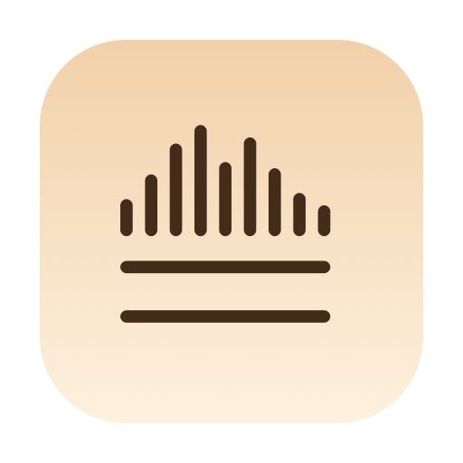
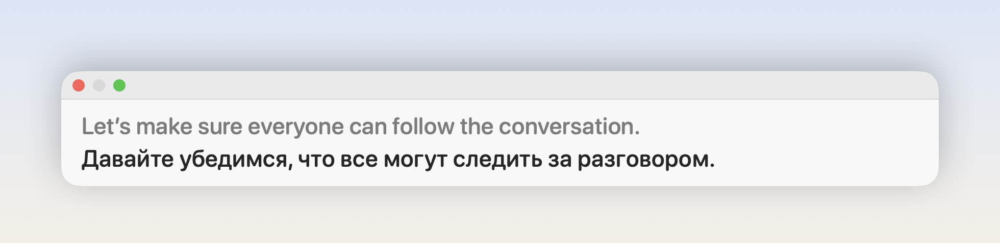

<p align="center">
  
</p>

<h1 align="center">Bilby</h1>

<p align="center">
  Live captions and translation for any audio playing on your Mac.<br>
  Everything runs on device. The microphone is never used.
</p>

<p align="center">
  <a href="https://github.com/sultanovazamat/bilby/releases/latest"></a>
  <a href="https://github.com/sultanovazamat/bilby/actions/workflows/ci.yml"></a>
  
  
  <a href="LICENSE"></a>
</p>

<p align="center">
  <a href="https://github.com/sultanovazamat/bilby/releases/latest/download/Bilby.dmg"><b>Download Bilby for Mac</b></a>
</p>

<picture>
  <source media="(prefers-color-scheme: dark)" srcset="docs/assets/hero-dark.png">
  
</picture>

## Why it exists

macOS 26 ships live translation only inside Messages, FaceTime and Phone.
Every meeting actually happens in Zoom, Meet or Teams. Bilby is the caption
bar for those — and for a video, a podcast, or anything else your Mac plays.

## What it does

- **Captions the app you choose.** Pick it under *Listen to* in the menu bar.
  Bilby hears what that app plays, and nothing else.
- **Translates each sentence into your language**, with the original above it,
  dimmer, so you can follow both. A draft translation follows the words as
  they come; when the sentence ends, it settles at full strength and does not
  change again.
- **Keeps the whole session.** The green button turns the two-line bar into a
  column of every sentence so far, for the moment you missed something.
- **Stays out of the way.** Two lines along the bottom of the screen, which
  never block a click when there is nothing to show. Text follows your system
  size, or Small, Medium or Large.
- **Says when it is on.** While captions run, a dot sits at the end of the
  icon in the menu bar.

## Privacy

- Speech recognition runs on your Mac's Neural Engine, and translation runs on
  device through Apple's Translation framework. Audio never leaves the Mac.
- Bilby downloads two things, once: the speech model, about 600 MB, the first
  time it starts; and each translation language when you add it.
- No account, no analytics. Bilby's own code makes no network requests.
- It never uses the microphone. It reads the audio an app plays, which macOS
  asks you to allow under *Screen & System Audio Recording*.
- Its log, `~/Library/Logs/Bilby/bilby.log`, is readable only by you, and never
  contains anything that was said: lengths and counts, not words.

## Install

You need a Mac with Apple silicon and macOS 26 Tahoe or later.

1. Download [Bilby.dmg](https://github.com/sultanovazamat/bilby/releases/latest/download/Bilby.dmg)
   and drag Bilby into Applications.
2. Open it. Bilby is not notarised yet, so macOS stops the first launch. Open
   **System Settings → Privacy & Security**, scroll to the message about Bilby,
   and click **Open Anyway**. It is offered for about an hour after the blocked
   launch. Each new version asks once.
3. Setup asks for permission to hear other apps, and which language you want
   to read, and fetches the speech model.

## Using it

Everything is in the menu bar icon:

- **Listen to** — the app whose audio to caption. Choosing one starts
  captions.
- **Translate to** — a language you have installed, or *Add Language…* for
  another.
- **Text Size** — *Match System Settings*, *Small*, *Medium* or *Large*.

On the bar itself, red stops captions, and green opens the column with the
whole session. *Open Bilby when I log in* is on the last page of setup.

Speech is recognised in English. Translation goes into any language Apple's
Translation framework offers for English.

## How it works

Apple's frameworks live at the edges. The middle is pure Swift, so the whole
product can be tested with strings — no audio, no network, no Apple
Intelligence.

```
edges (untestable)              core (pure, covered by tests)        ui
──────────────────              ─────────────────────────────        ──────────────
SystemAudioTap    (CoreAudio) ─┐
AudioTranscribing (FluidAudio)─┼──▶  CaptionSession          ──▶   CaptionPanel
Translating       (Translation)┘       └── CaptionEngine            MenuBarExtra
                                             ├── ClauseBuffer
                                             └── Transcript
```

Each edge the core depends on is a protocol with a real implementation and a
fake: `Translating` in `Ports.swift`, `AudioTranscribing` in BilbySources.
Swapping translation for a local model is a new `Translating`; the core does
not change.

`ClauseBuffer` is where the product's feel lives: it decides when speech is
complete enough to translate. Cut too early and the grammar is wrong; cut too
late and captions lag.

The reasoning behind each decision is in [`docs/plans`](docs/plans), written
as it was made.

## Build from source

With Xcode 26 on an Apple silicon Mac:

```
./Scripts/check.sh              # tests, purity, release build, portable app — run this
./Scripts/make-app.sh           # ~/Applications/Bilby.app, debug
./Scripts/release.sh            # .build/Bilby.dmg: release build, checked, ad-hoc signed
swift run BilbyPreview --output .build/previews   # every setup scene, both appearances
```

`check.sh` builds in release on purpose: strict concurrency finds races under
whole-module optimisation that the debug build accepts.

`release.sh` lays the install window out with `dmgbuild`, which it installs
on first use into `.build/dmgtools`, so that one run needs `python3` and a
network. `Scripts/dmg-settings.py` is what the window looks like;
`Scripts/check-dmg.sh` reads the finished image back and fails if it does not
match. How releases are cut is in [`docs/releasing.md`](docs/releasing.md).

## Contributing

Issues and pull requests are welcome; [`CONTRIBUTING.md`](CONTRIBUTING.md)
says how the code is organised and what a change needs to pass.

## Credits

- [FluidAudio](https://github.com/FluidInference/FluidAudio) by
  FluidInference: speech recognition on the Neural Engine. Apache-2.0.
- [Parakeet Unified 0.6B](https://huggingface.co/FluidInference/parakeet-unified-en-0.6b-coreml),
  based on NVIDIA's Parakeet and converted for Core ML by FluidInference.
  CC BY 4.0.
- Apple's Translation framework, for translation on device.
- [dmgbuild](https://github.com/dmgbuild/dmgbuild), for the install window.

Their licences and notices are in [`THIRD_PARTY_NOTICES.md`](THIRD_PARTY_NOTICES.md),
which also ships inside the app.

## Licence

[MIT](LICENSE) © 2026 Azamat Sultanov
